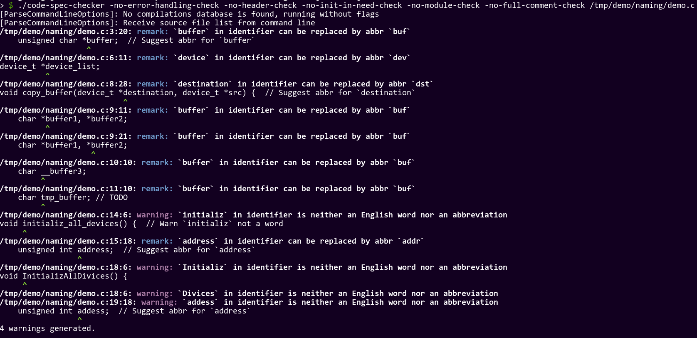
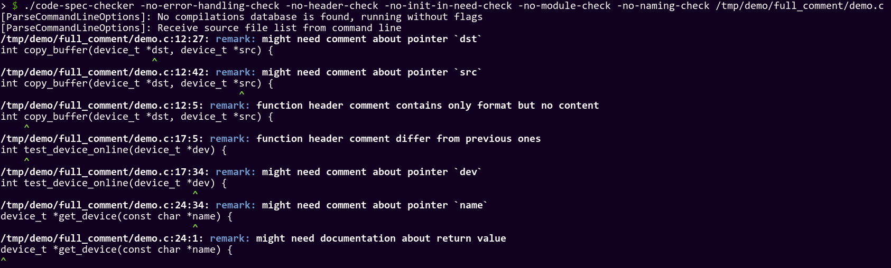
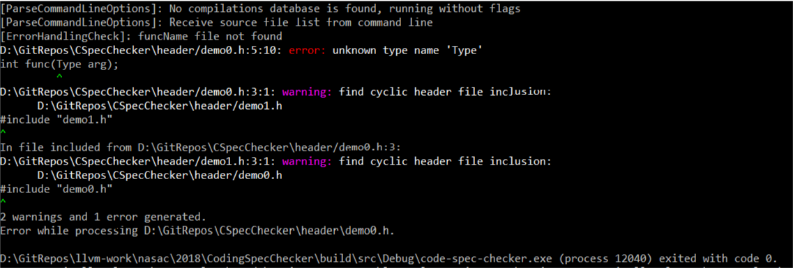
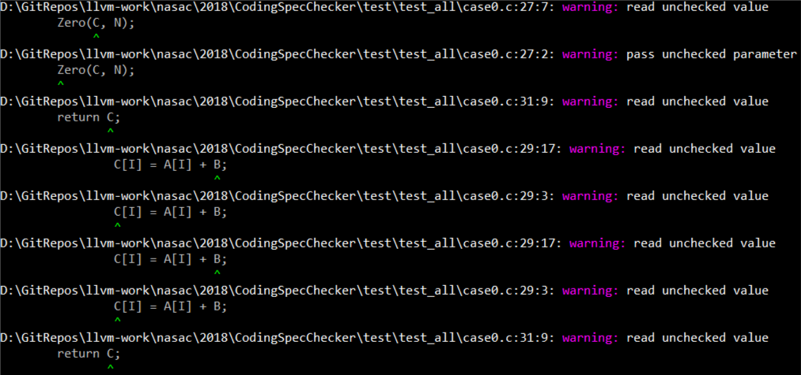
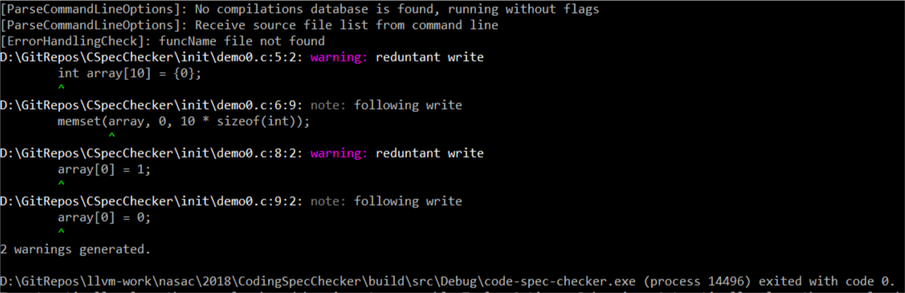

## 简单示例

### 命名检查

文件：[demo.c](naming/demo.c)

结果：

在上图中，我们指出了源文件中函数、变量命名中存在的非英文单词，以及变量命名中可以使用的缩写。

### 注释内容检查

文件：[demo.c](full_comment/demo.c)

结果：

在上图中，我们指出了函数参数中未在注释里说明的指针、风格不一致的注释，以及未在注释中说明的指针类型返回值。

### 头文件检查

文件 : [demo0.h](header/demo0.h)，[demo1.h](header/demo1.h)

结果：

上图中，工具指出了demo0.h文件中对未定义类型`Type`的引用，说明该头文件不是自包含的；随后指出demo0.h和demo1.h出现循环包含的位置。

### 函数参数检查

文件：[demo0.c](module/demo0.c)

结果：

demo0中没有检查任何输入参数就使用且调用模块内部函数时未保证参数合法性，工具会指出所有可能路径上未检查参数使用的情况。因为各种路径组合数量比较多，结果只截取了一部分。

### 按需初始化检查

文件：[demo0.c](init/demo0.c)

结果：

